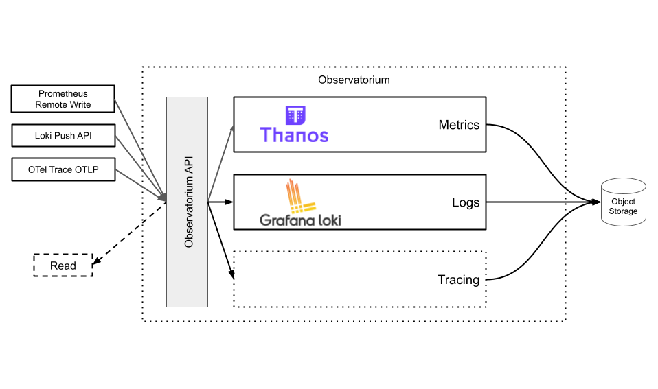

 

### Multi-Tenant, Flexible, Scalable, Observability Backend

Observatorium is multi-tenant, easy to operate, scalable open source observability "distribution", allowing you to ingest, store and use common observability signals like metrics, logging and tracing. It’s a meta project that allows you to manage, integrate and combine multiple well-established existing projects like [Thanos](https://thanos.io), Loki, Tempo/Jaeger etc under a single consistent system with well-defined tenancy APIs and signal correlation capabilities. It adds missing gaps like consistency, multi-tenancy, security and resiliency pieces that are needed for a robust backend.

### Context 

As the Red Hat Monitoring Team, we were focusing on the Observability software and concepts since the CoreOS acquisition. From the beginning, one of our main goals was to establish a stable in-cluster metric collection, querying, and alerting for OpenShift clusters. With the growth of managed Openshift (OSD) clusters, the scope of the team goal has extended: we had to develop a scalable, global, metric stack that can be run in local as well as a central location for monitoring and telemetry purposes. We also worked together with Red Hat Logging and Tracing teams to implement something similar for logging and tracing. We’re also working on Continuous Profiling aspects.

From the very beginning our teams were leveraging Open Source to accomplish all those goals. We believe that working with the communities is the best way to have long term, successful systems, share knowledge and establish solid APIs. You might have not seen us, but members of our teams have been actively maintaining and contributing to major Open Source standards and projects like Prometheus, Thanos, Loki, Grafana, kube-state-metrics (KSM), prometheus-operator, kube-prometheus, Alertmanager, cluster-monitoring-operator (CMO), OpenMetrics, Jaeger, ConProf, Cortex, SIG CNCF Observability, SIG K8s Instrumentation and more.

### Work In Progress

While metric and logging part using Thanos and Loki is used in production at Red Hat,documentation, full design, user guides, different configurations support are in progress.

Stay Tuned!
