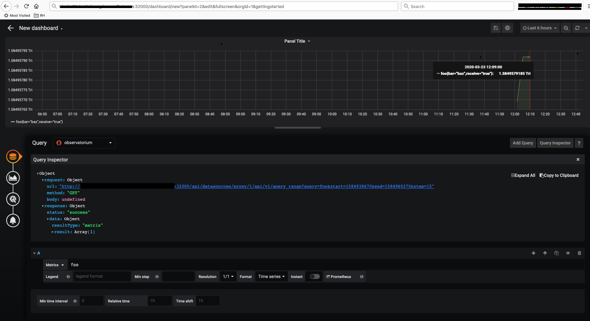

# Observatorium Operator


## Prelude

Check the following resources for more information about Observatorium:
* [Documentation repository](https://github.com/observatorium/docs/)
* [Observatorium API](https://github.com/observatorium/observatorium/)
* [Observatorium deployments repository](https://github.com/observatorium/deployments)
* [Locutus - The framework which the operator is based on](https://github.com/brancz/locutus)


## How to deploy - Kubernetes and OpenShift

In order to ease the installation of Observatorium, an operator is available.

### Prerequisites

#### Create Namespaces
```shell script
kubectl create namespace observatorium
```


#### S3 storage endpoint and secret
For **testing purposes** you may use [minio](https://github.com/minio/minio) as describe below.
```shell script
kubectl create namespace observatorium-minio
kubectl apply -f https://raw.githubusercontent.com/observatorium/deployments/master/environments/dev/manifests/minio-secret.yaml
kubectl apply -f https://raw.githubusercontent.com/observatorium/deployments/master/environments/dev/manifests/minio-pvc.yaml
kubectl apply -f https://raw.githubusercontent.com/observatorium/deployments/master/environments/dev/manifests/minio-deployment.yaml
kubectl apply -f https://raw.githubusercontent.com/observatorium/deployments/master/environments/dev/manifests/minio-service.yaml
```

### Deployment

#### Prometheus CRDs - Kubernetes Only
You may skip this step if you are using OpenShift, in which the CRD is already available as a part of the monitoring stack.
```shell script
kubectl apply -f https://raw.githubusercontent.com/coreos/kube-prometheus/master/manifests/setup/prometheus-operator-0servicemonitorCustomResourceDefinition.yaml
kubectl apply -f https://raw.githubusercontent.com/coreos/kube-prometheus/master/manifests/setup/prometheus-operator-0prometheusruleCustomResourceDefinition.yaml
```

#### RBAC Configuration
```shell script
kubectl apply -f https://raw.githubusercontent.com/observatorium/deployments/master/operator/manifests/cluster_role.yaml
kubectl apply -f https://raw.githubusercontent.com/observatorium/deployments/master/operator/manifests/cluster_role_binding.yaml
```

#### Deploy Observatorium CRD and Operator
* In case you need to force a new image download (e.g. development environment), please refer to the [development section](#Development).
```shell script
kubectl apply -f https://raw.githubusercontent.com/observatorium/deployments/master/operator/manifests/crds/core.observatorium.io_observatoria.yaml
kubectl apply -f https://raw.githubusercontent.com/observatorium/deployments/master/operator/manifests/operator.yaml
```

## Deploy an example CR
```shell script
kubectl apply -n observatorium -f https://raw.githubusercontent.com/observatorium/deployments/master/example/manifests/observatorium.yaml
```
Monitor the CR status and wait for status --> Finished
```shell script
kubectl -n observatorium get observatoria.core.observatorium.io observatorium-xyz -o=jsonpath='{.status.conditions[*].currentStatus}'

Finished
```

### Expected Result
```shell script
kubectl -n observatorium get all

NAME                                                              READY   STATUS    RESTARTS   AGE
pod/observatorium-xyz-cortex-query-frontend-7bc9b64c65-f6ksx      1/1     Running   0          2m50s
pod/observatorium-xyz-observatorium-api-c8ddc9979-b8wfz           1/1     Running   0          3m18s
pod/observatorium-xyz-thanos-compact-0                            1/1     Running   0          2m13s
pod/observatorium-xyz-thanos-query-69fbc7b546-wmxzk               1/1     Running   0          2m6s
pod/observatorium-xyz-thanos-receive-controller-f89fdf5c7-jc7vd   1/1     Running   0          63s
pod/observatorium-xyz-thanos-receive-default-0                    1/1     Running   0          60s
pod/observatorium-xyz-thanos-receive-default-1                    1/1     Running   0          49s
pod/observatorium-xyz-thanos-receive-default-2                    1/1     Running   0          45s
pod/observatorium-xyz-thanos-rule-0                               1/1     Running   0          37s
pod/observatorium-xyz-thanos-rule-1                               1/1     Running   0          25s
pod/observatorium-xyz-thanos-store-memcached-0                    2/2     Running   0          2m28s
pod/observatorium-xyz-thanos-store-shard-0-0                      1/1     Running   0          22s

NAME                                                  TYPE        CLUSTER-IP      EXTERNAL-IP   PORT(S)                         AGE
service/observatorium-xyz-cortex-query-frontend       ClusterIP   10.96.104.0     <none>        9090/TCP                        2m43s
service/observatorium-xyz-observatorium-api           ClusterIP   10.96.233.236   <none>        8081/TCP,8080/TCP               3m5s
service/observatorium-xyz-thanos-compact              ClusterIP   10.96.185.145   <none>        10902/TCP                       2m21s
service/observatorium-xyz-thanos-query                ClusterIP   10.96.9.60      <none>        10901/TCP,9090/TCP              117s
service/observatorium-xyz-thanos-receive              ClusterIP   10.96.135.197   <none>        10901/TCP,10902/TCP,19291/TCP   52s
service/observatorium-xyz-thanos-receive-controller   ClusterIP   10.96.15.57     <none>        8080/TCP                        82s
service/observatorium-xyz-thanos-receive-default      ClusterIP   None            <none>        10901/TCP,10902/TCP,19291/TCP   67s
service/observatorium-xyz-thanos-rule                 ClusterIP   None            <none>        10901/TCP,10902/TCP             45s
service/observatorium-xyz-thanos-store-memcached      ClusterIP   None            <none>        11211/TCP,9150/TCP              2m36s
service/observatorium-xyz-thanos-store-shard-0        ClusterIP   None            <none>        10901/TCP,10902/TCP             30s

NAME                                                          READY   UP-TO-DATE   AVAILABLE   AGE
deployment.apps/observatorium-xyz-cortex-query-frontend       1/1     1            1           2m51s
deployment.apps/observatorium-xyz-observatorium-api           1/1     1            1           3m18s
deployment.apps/observatorium-xyz-thanos-query                1/1     1            1           2m6s
deployment.apps/observatorium-xyz-thanos-receive-controller   1/1     1            1           104s

NAME                                                                    DESIRED   CURRENT   READY   AGE
replicaset.apps/observatorium-xyz-cortex-query-frontend-7bc9b64c65      1         1         1       2m50s
replicaset.apps/observatorium-xyz-observatorium-api-c8ddc9979           1         1         1       3m18s
replicaset.apps/observatorium-xyz-thanos-query-69fbc7b546               1         1         1       2m6s
replicaset.apps/observatorium-xyz-thanos-receive-controller-f89fdf5c7   1         1         1       104s

NAME                                                        READY   AGE
statefulset.apps/observatorium-xyz-thanos-compact           1/1     2m14s
statefulset.apps/observatorium-xyz-thanos-receive-default   3/3     60s
statefulset.apps/observatorium-xyz-thanos-rule              2/2     37s
statefulset.apps/observatorium-xyz-thanos-store-memcached   1/1     2m28s
statefulset.apps/observatorium-xyz-thanos-store-shard-0     1/1     23s
```

## Test

### Expose observatorium API for external traffic
* In Kubernetes
```shell script
kubectl -n observatorium patch svc observatorium-xyz-observatorium-api --type='json' -p '[{"op":"replace","path":"/spec/type","value":"NodePort"}]'
```
* In OpenShift
```shell script
oc -n observatorium expose svc observatorium-xyz-observatorium-api --port=public
```

### (Option A) Transmit Metrics via Remote Write Client
```shell script
kubectl -n default apply -f https://raw.githubusercontent.com/observatorium/deployments/master/tests/manifests/observatorium-up.yaml
kubectl wait --for=condition=complete --timeout=5m -n default job/observatorium-up
````
Result
```shell script
job.batch/observatorium-up condition met
```

### (Option B) Configure Prometheus Remote Write
* Example taken from CRC (Openshift), Prometheus deployed as a part of the monitoring operator.
* Note: If this is applied to a separate cluster, the url should be dns resolvable.
```shell script
cat << EOF | kubectl -n openshift-monitoring apply -f -
apiVersion: v1
data:
  config.yaml: |
    prometheusK8s:
      remoteWrite:
      - url: http://observatorium-api-observatorium.apps-crc.testing/api/metrics/v1/write
      externalLabels:
        demo_spoke_cluster: observatorium_demo
kind: ConfigMap
metadata:
  name: cluster-monitoring-config
  namespace: openshift-monitoring
EOF
```

### Grafana
Data source is set to query the observatorium-api, which proxies the request to thanos-query.
Thus, the data source URL: `http://observatorium-xyz-observatorium-api.observatorium.svc.cluster.local:8080/api/metrics/v1`

#### Deploy Grafana
```shell script
kubectl -n observatorium apply -f https://raw.githubusercontent.com/observatorium/deployments/master/doc/operator/grafana/grafana.yaml
kubectl -n observatorium apply -f https://raw.githubusercontent.com/observatorium/deployments/master/doc/operator/grafana/grafana-cm.yaml
kubectl -n observatorium apply -f https://raw.githubusercontent.com/observatorium/deployments/master/doc/operator/grafana/grafana-svc.yaml
```

#### Expose Grafana for external traffic
* In Kubernetes
```shell script
kubectl -n observatorium patch svc grafana --type='json' -p '[{"op":"replace","path":"/spec/type","value":"NodePort"}]'
```
* In OpenShift
```shell script
oc -n observatorium expose svc grafana
```

#### Browse Grafana
You should now be able to see the 'foo' metric generated by the up client you invoked beforehand.


## Development
* Create the operator while forcing Kubernetes / OpenShift to download the image.  
```shell script
curl https://raw.githubusercontent.com/observatorium/deployments/master/operator/manifests/operator.yaml | \
sed 's/imagePullPolicy\: IfNotPresent/imagePullPolicy\: Always/g' > observatorium-operator.yaml && \
kubectl -n default create -f observatorium-operator.yaml && rm -f observatorium-operator.yaml
```
