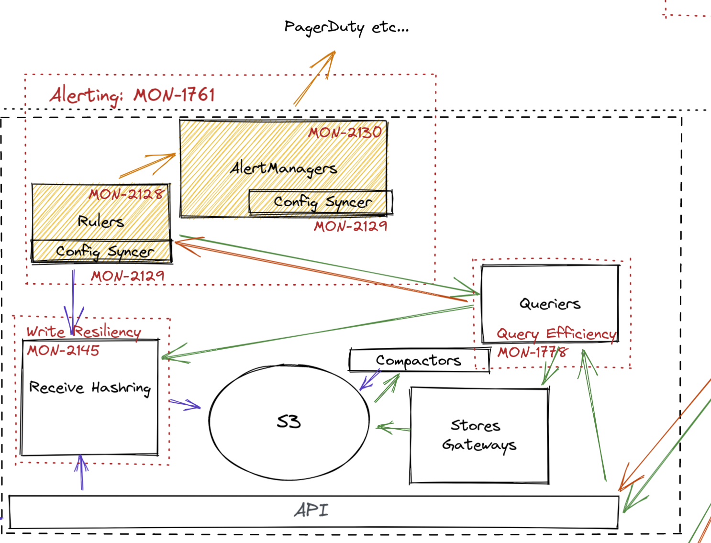

# Observatorium Alerting

* **Owners:**
  * `@onprem` `@bwplotka`

* **Related Tickets:**
  * https://issues.redhat.com/browse/MON-1761

* **Other docs:*
  * -????

> TL;DR: For monitoring use cases, especially tenants of the metric signal of Observatorium has to be able to configure Prometheus-based alerts that will be evaluated for a given interval. If triggered they should notify desired target (receiver) e.g PagerDuty using Alertmanager Configuration. Users should also be able to see the status of all alerts through Prometheus-like Alerts HTTP API. This proposal specifies how such a system can be deployed within Observatorium.

## Why

Alerting is a critical component of reliable monitoring. We can build automation or notify humans in a reactive or proactive manner instead of watching dashboards.

### Pitfalls of the current solution

Observatorium did not have alerting defined before.

## Goals

Definition: 
* Alert Routing: Configuration of Alertmanager related to receiver target config and its routing. 

Goals:
* Tenant should be able to use alerting rules.
  * Alerting Rules via GET and PUT via HTTP (Rules API)
* Tenants should be able to read what is the status of configured alerts (Prometheus Alert API GET)
* Tenants are able to route alerts:
  * Alerting Routing via GET and PUT via HTTP API.
* Both alerts and alerting rules should be multi-tenant.

## Non-Goals

* (?) UI for Alerts/Rules, Alert Status, AM Routing, AM Alerts …
* (?) Alertmanager Alerts API, Config/Status
* Silences
* Inhibits
* Scaling Rulers
* Scaling Alertmanager beyond 3 replicas.
* Routing tester.

## Audience of this proposal

Observatorium Devs and Users.

## How

Within work for [Rules API proposal](https://observatorium.io/docs/proposals/20201019-prometheus-rules-in-observatorium-api.md/) we already added Rules APIs for reading and configuring rules which include both recording and alerting rules.

For example, to save alerts we can already PUT the following object to `/api/metrics/v1/{tenant}/api/v1/rules/raw`

```
groups:
  - name: test-oidc
    interval: 5s
    rules:
      - alert: HighRequestLatency
        expr: job:request_latency_seconds:mean5m{job="second"} > 0.5
        for: 10m
        labels:
          team: alpha
```

Such rule will be saved through Observatorium API, then Rule-Store to object storage for the specified tenant. It can be then listed through a similar endpoint and GET.

### Alerts

Such configuration will be then eventually synchronized with tenant’s Rulers using ConfigSync. The Ruler itself has to communicate on 4 levels. All connections are presented in the diagram below.



1. Alerts will be evaluated based on periodic requests to any replica of  HTTP Query API of Query-frontend (Question: Or querier?). 
2. Triggered alerts will be pushed to all replicas of  Alertmanager (discussed later) through AM HTTP API.
3. It exposes gRPC Rules API which is consumed by Queriers.
4. It saves samples to any replica of Receiver Router (or RouterIngestor). 

### Alert eval status

We expect Rulers to be connected to Queriers through gRPC Rules API (NOTE, not Store API as we have now). This allows queries to be able to present federate views through API. In order to fulfil the full story we also need:

* Implement Matching / Filtering by label/tenant on Alerts HTTP API of Querier.
* Expose read Alert API on Observatorium API

###  Alert Routing

Triggered alerts are essential to be reliably forwarded to correct notifications points as soon as they are triggered. We propose deploying 3-replicas Alertmanager HA, through our configuration (Question: Without Prometheus Operator).

We propose defining an additional HTTP API for routing on `/api/metrics/v1/{tenant}/api/v1/routing/raw` path in Observatorium API.

Types based on [Prometheus Operator AM Config](https://github.com/prometheus-operator/prometheus-operator/blob/9c0db5656f04e005de6a0413fd8eb8f11ec99757/pkg/apis/monitoring/v1alpha1/alertmanager_config_types.go#L69).

Paste here TBD.

NOTE that here we will expect users to pass SECRETS (keys, TLS, passwords etc) to 3rd party receivers. We propose to at the moment save it in object storage in plain text (Question: This sounds bad, what we can do better here?).

We could allow all read API as well of write of Inhibits and Silences of Alertmanager (https://github.com/prometheus/alertmanager/blob/main/api/v2/openapi.yaml) by adding auth and multi-tenancy layer, but we propose to deal with that in a separate epic/proposal.

## Alternatives

### Alertmanager per tenant


### ??


## Action Plan

The tasks to do in order to migrate to the new idea.

* [ ] Use stateless Ruler
* [ ] Implement Matching / Filtering by label/tenant on Alerts HTTP API of Querier.
* [ ] Expose read Alert API on Observatorium API
* [ ] Move https://github.com/observatorium/rules-objstore to be a lib
* [ ] Develop Config Syncer based on Rule-Syncer and Rules Store
* [ ] API talking directly to object storage using Rule Objstore lib

Side tasks, currently out of scope:

* [ ] Scaling control for Rulers e.g how the configuration will be sharded? (for now one per tenant is fine)
* [ ] Forwarding AM APIs

