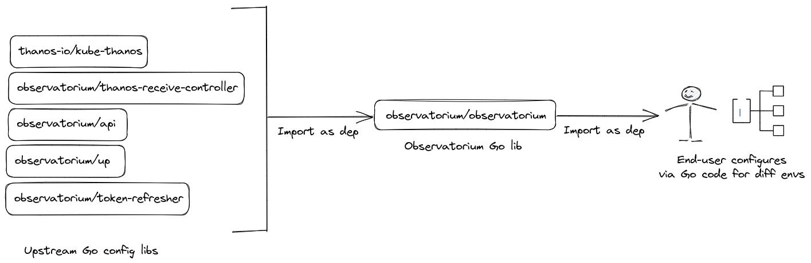

# Observatorium Golang-based Configuration

* **Owners:**
  * `@saswatamcode` `@moadz`

* **Other docs:**
  * None

## TL;DR

This proposal explores the possiblity of using Go as a configuration language and adding Observatorium configuration libraries written in Go that allow end-users to import and customize them directly. It explores the pitfalls of using jsonnet as a front-level interface for Observatorium, and how this currently affects Observatorium installation model.

## Pitfalls of Current Solution

Currently, we primarily use [jsonnet](https://jsonnet.org/) in Observatorium, to compose a "meta-project" library that allows generating configuration for a multi-tenant scalable observability system.

While jsonnet is a commonly used configuration templating language, there are certain issues with how jsonnet acts as a front-level configuration interface, which causes it to not be preferable to end-users.

Templating via jsonnet, while achievable, often results in complex, unreadable code, and due to no doc generation and low IDE support becomes virtually undiscoverable. Codifying and abstracting operational practices and knowledge in jsonnet is difficult and time-consuming, due to the lack of type safety and testing practices. In certain cases, pre-existing upstreams also cannot be used and jsonnet templating needs to be written manually.

Furthermore, for a project like Observatorium, this leads to a complex-to-adopt and messy installation model. An end-user is forced to go through one of the below,
* Scale the steep learning curve of jsonnet initially (if needed), and understand complex Observatorium jsonnet library internals and abstractions (without documentation or discoverability) to be able to configure it exactly according to needs (sometimes even rewrite for customizability)
* Copy over pre-generated YAML in observatorium/observatorium and change it manually
* Reference generated YAML and rewrite it in templating the end-user is comfortable with

## Goals

Compose Observatorium configuration as a Go-based library using configuration-as-code concepts, that allows end-users to,
* Easily discover configuration abstractions, without having to go through steep configuration templating language learning curves and having to explore templating code in-depth
* Easily utilize pre-defined abstractions for their specific environments, and be able to override configuration at will, without hassle
* Be able to rely on tested configuration generation, battle-tested versioning via Go modules and automatic documentation via [goDoc](https://blog.golang.org/godoc-documenting-go-code)
* Be able to pull in, their own upstreams directly by just importing Go struct for their own configuration (sidecars/config files, etc)
* Have a consistent installation and usage model for Observatorium, as a customizable simple static configuration generation solution, with sane defaults

## Non-Goals

* Deprecating/removing jsonnet entirely. This is only proposing Go-based configuration as an alternative method of usage, but does not take away from exisiting jsonnet templating in any way
* Operator or operator generation. This proposal only aims for static configuration generation, and is not related to applying this configuration or automating it

## Audience of this proposal

Observatorium Devs and Users.

## How

### Import path

In theory, we can arrange Go-based configuration libraries in Observatorium in the same fashion as we do for jsonnet with jsonnet-bundler i.e, something like below, only this would rely on Go modules for versioning and dependency management.



### Proof-of-Concept Library

To demonstrate how Go-based configuration can work, the same PR as this proposal includes a proof-of-concept implementation of Observatorium API Kubernetes configuration, that utilizes a builder pattern. It codifies the operational practices needed to deploy the API via easy-to-use abstractions.

**NOTE**: While a lot of this can likely be upstreamed to observatorium/api repo, it showcases the important aspects of how a Go-based configuration libary behaves and leads to a custom YAML.

For generating YAML from Go structs, we utilize the [`mimic`](https://github.com/bwplotka/mimic) tool, its associated [best practices](https://github.com/bwplotka/mimic/blob/main/docs/best_practice.md) and directory structure, to manage this configuration.

The directory structure under `configuration_go` represents the following

* `abstr`: Abstractions are used to (as the name suggests) abstract away the underlying config and structs to the caller allowing complex configurations or concepts to be created with minimal code.
  * `abstr/kubernetes/api`: Kubernetes abstractions for deployment of Observatorium API.
* `providers`: Providers are a way of defining a configuration specification in Go structs for projects that either do not currently expose their configuration structs or are difficult to work with (due to deps, complexity, licensing etc.)
  * `providers/api`: Configuration passed to Observatorium API itself.
* `generator`: Contains useful YAML generation wrapper functions like `GenerateWithMimic`.
* `k8sutil`: As the name suggestes contains several reusable constants/variables for easy definition of Kubernetes structs.
* `openshift`: Contains OpenShift template wrapper function which sorts K8s objects for consistent diffs.
* `manifests`: Generated sample manifests demonstrating usage of API library in [`main.go`](../../configuration_go/main.go).

The PoC Observatorium API configuration abstraction has a contructor,

```go
// NewObservatoriumAPI returns a new instance of Observatorium API, customized with options.
// Also includes options for adding sidecars.
// Returns the following K8s Objects:
// Deployment
// Service
// ServiceAccount
// ConfigMap
// Secret
func NewObservatoriumAPI(opts ...ObservatoriumAPIOption) *observatoriumAPI {
```

that accepts several options to customize functionality of the API deployment such as,

```go
// WithMetrics enables metrics signal for Observatorium API and includes passed in URL args as flags.
// If any of the URLs are empty, the flags are not included.
func WithMetrics(metricsRead, metricsWrite, metricsRules string) ObservatoriumAPIOption {
	return func(a *observatoriumAPI) {
		a.metricsRead = metricsRead
		a.metricsWrite = metricsWrite
		a.metricsRules = metricsRules
	}
}
```

It even exposes options to add a sidecar container such as [opa-ams](https://github.com/observatorium/opa-ams) to the API deployment.

```go
// WithSidecars allows overriding default K8s Deployment and adding additional containers,
// alongside Observatorium API.
// Use SidecarConfig struct to attach additonal volumes, service ports and service monitor
// scrape endpoints for these sidecars.
func WithSidecars(s k8sutil.SidecarConfig) ObservatoriumAPIOption {
	return func(a *observatoriumAPI) {
		a.sidecars = s
	}
}
```

With these options we can define Kubernetes structs for the various Kubernetes Objects needed to deploy Observatorium API, and return them as a map containing the manifest name and [`runtime.Object`](https://pkg.go.dev/k8s.io/apimachinery/pkg/runtime#Object) (i.e, as `k8sutil.ObjectMap`) via the `Manifests()` method.

```go
// Manifests creates resultant K8s YAML manifests for customized Observatorium API deployment
// as a map, containing manifest name and runtime.Object.
// This provides the ability to override options of the returned manifests
// in a specific manner (in case the exported ObservatoriumAPIOption functions do not suffice).
func (c *observatoriumAPI) Manifests(opts ...ObservatoriumAPIOption) k8sutil.ObjectMap {
```

Finally we can use all these options to simply generate the Observatorium API Kubernetes configuration we need, in `configuration_go/manifests/config/`.

```go
	// Observatorium API with no sidecar and a serviceMonitor.
	generator.GenerateWithMimic(
		g,
		api.NewObservatoriumAPI(
			api.WithLogLevel("debug"),
			api.WithMetrics(
				"http://observatorium-xyz-thanos-query-frontend.observatorium.svc.cluster.local:9090",
				"http://observatorium-xyz-thanos-receive.observatorium.svc.cluster.local:19291",
				"http://observatorium-xyz-rules-objstore.observatorium.svc.cluster.local:8080",
			),
			api.WithLogs(
				"http://observatorium-xyz-loki-query-frontend-http.observatorium.svc.cluster.local:3100",
				"http://observatorium-xyz-loki-distributor-http.observatorium.svc.cluster.local:3100",
				"http://observatorium-xyz-loki-ruler-http.observatorium.svc.cluster.local:3100",
				"http://observatorium-xyz-loki-querier-http.observatorium.svc.cluster.local:3100",
			),
			api.WithTraces(
				"http://observatorium-xyz-jaeger-query.observatorium.svc.cluster.local:16686/",
				"observatorium-xyz-otel-collector:4317",
			),
			api.WithRateLimiter("observatorium-xyz-gubernator.observatorium.svc.cluster.local:8081"),
			api.WithRBACYAML(string(rbacData)),
			api.WithTenantsSecret(map[string]string{"tenants.yaml": string(tenantsData)}),

			api.WithImage("quay.io/observatorium/api", "main-2023-01-24-v0.1.2-318-g5f4fdf4"),
			api.WithName("observatorium-xyz"),
			api.WithNamespace("observatorium"),
			api.WithReplicas(3),
			api.WithAPIResources(apiResources),
			api.WithServiceMonitor(),
		).Manifests(),
		"config",
	)
```

### Future Installation Model

We can even leverage [`obsctl`](https://github.com/observatorium/obsctl) in the future to allow generating boilerplate Go code that imports Observatorium Go config and provides the user with commands to generate sane default YAML config.

This can lead to essentially, a three step deployment process,

```bash
obsctl gen observatorium-default
go main.go generate --output=manifests
kubect apply -f manifests/
```

### Pros:

* Go is a strongly typed language which doesn't only mean type safety in configuration definitions, but also having help from the compiler/IDE of choice to figure out exactly what fields and types a struct can take in
* Unit/e2e testing configuration generation is possible and certain practices like naming conventions are easy to enforce
* Doc generation directly from code and tools like https://pkg.go.dev/ mean superior discoverability and ease-of-use
* Direct usage of pre-written structs, like Kubernetes structs, by importing them from upstream
* Unified and simple installation model, with no such steep learning curve or custom config DSL

### Cons:
* Some upstream config-only libraries like kube-thanos will also need to be modifed and "ported" to Go
* Strong types means that in some cases, there are restrictions to what can be configured to a particular field
* For the time being, need to maintain both jsonnet and Go libraries

## Alternatives

* Continuing with the existing jsonnet configuration setup
* Utilizing some other method of configuration
