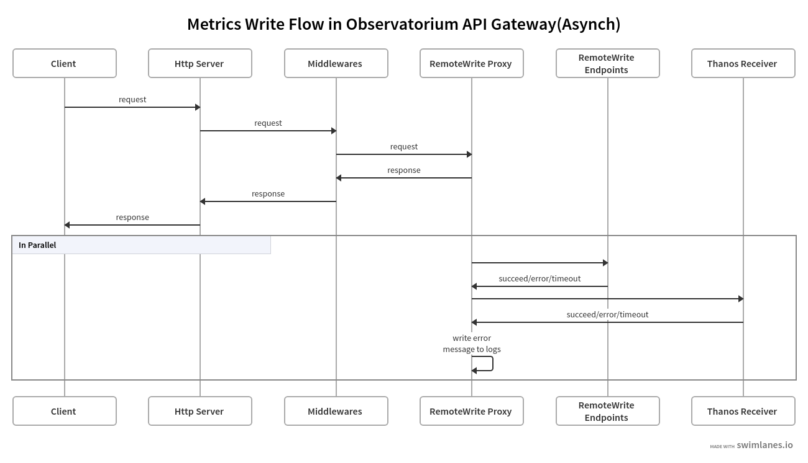

# Additional Metrics Write Endpoints Proposal

* **Owners:**:
  * `@marcolan018`

* **Related Tickets:**
  * `<JIRA, GH Issues>`

* **Other docs:**
  * [Exporting Metrics To Additional Consumers in RedHat Advanced Cluster Management for Kubernetes](https://docs.google.com/document/d/1t7GodF4s_V5MtFtjTeiT0UFeQuu7cuSzz9-7FEENDsQ) (internal Red Hat link)

## TLDR

We propose to support additional metrics write endpoints. The metrics write requests can be forwarded to additional backend endpoints, which support prometheus remote write protocol, besides thanos receivers.

## Why
Currently the observatorium API always forwards the metrics to Thanos. Given that users have multiple consumers of metric data, they have a requirement for the collected metrics to be made available to these additional consumers. Although the users can pull the metrics from Thanos side directly, but that's not a realtime solution. Also it will lead to heavy workload on Thanos if users consistently query massive metrics from it. We need a way to let observatorium API to forward the metrics to more than one targets.

## Goals

* Observatorium API can pushes data to configured additional metrics write endpoints, secured or non-secured
* Observatorium API continues to push data to Thanos Receivers even when the additional metrics write endpoints blocked.

## Non-Goals

* Other types of observability data(e.g. logs) to multiple endpoints not considered

## How

Currently Observatorium  API only supports one metrics write endpoint. We propose an update in Observatorium API, to add a new component RemoteWrite Proxy, to clone the request body of incoming metrics write requests, then forward to additional write endpoints, which support prometheus remote write protocol.
For each additional metrics write endpoint, the RemoteWrite Proxy will clone the request body and send it to the endpoint based on its' configurations. A sample additional write endpoints configuration with two endpoints is like below:
```yaml
endpints:
  - name: remotewrite
    url: http://xyz/write
  - name: secured_remotewrite
    url: https://xyz:8443/secured_write
    tlsConfig:
      ca: /var/certs/ca.crt
      cert: /var/certs/tls.crt
      key: /var/certs/tls.key
``` 
The proposed sequence diagrame for incoming metrics write request is as below:


The client will send metrics write request to observatorium API, the request will reach the RemoteWrite Proxy after some middlewares handling. RemoteWrite Proxy will return once it receives the request, to notifify the client that the request has reached, already passed some necessary checking such as authentication, and ready to be forwarded to backend write endpoints. In the meantime, it will send the request to the backend write endpoints, including Thanos receiver. If any request fails finally, the RemoteWrite Proxy will record the errors in the logs. Also, there will be a new metrics named remote_write_requests_count to expose the status for the requests.

## Action Plan

* Iterate and finalise this design document.
* Implement the Observatorium API to push metrics to additional write endpoints.
* Update Observatorium operator to support additional write endpoints.
